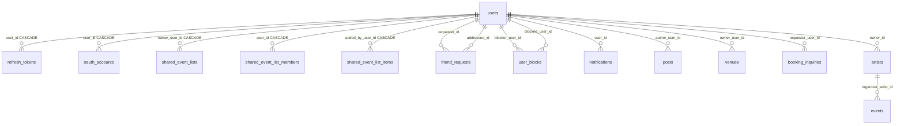
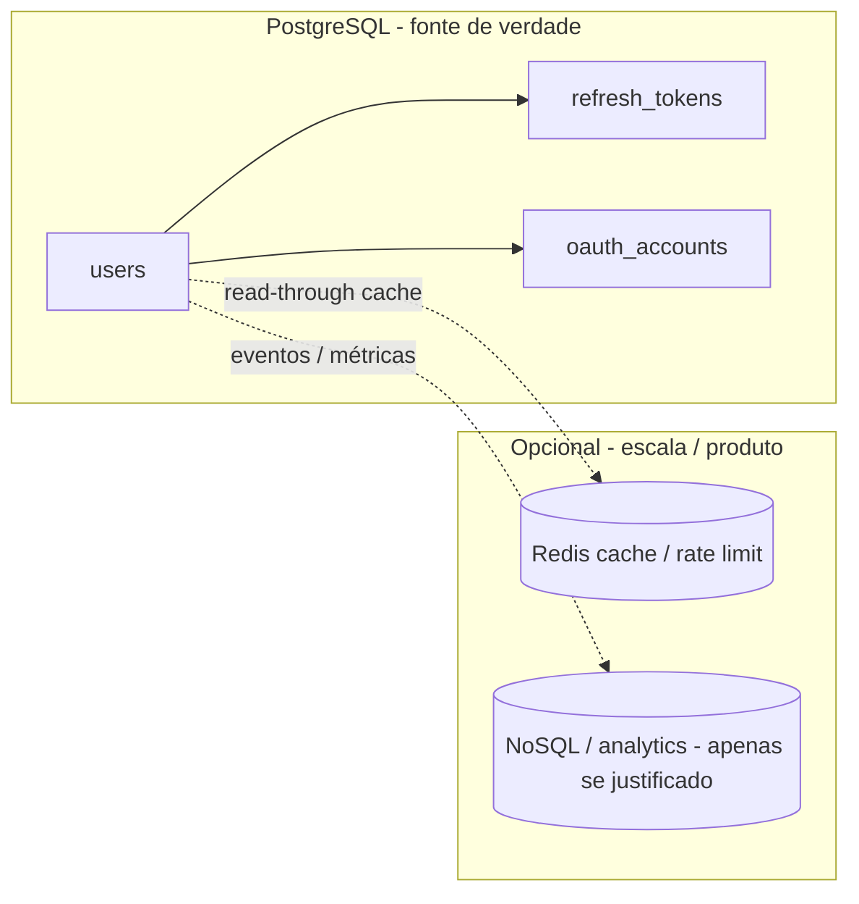

# Estrutura de dados — utilizador, autenticação, preferências e configuração

Este documento define **onde** persistimos dados relacionados ao utilizador: **PostgreSQL (relacional)** como fonte de verdade operacional, **campos JSON (`jsonb`)** para perfis semi-estruturados dentro do SQL, e **quando** um armazenamento **NoSQL** (ou cache em memória) entra no desenho — sem substituir o modelo relacional do núcleo.

Documentos relacionados:

- [ddd-modules-and-security.md](./ddd-modules-and-security.md) — limites de módulos (Auth, User, Authorization), guards e convenções DDD.

---

## 1. Princípios

| Critério | Relacional (PostgreSQL) | NoSQL / cache (opcional) |
|----------|-------------------------|---------------------------|
| **Integridade** | Identidade de utilizador, credenciais, ligações OAuth, tokens de sessão com FK e índices únicos | Dados derivados, filas, ou documentos com schema volátil |
| **Consistência** | Transações ACID para sign-up, link OAuth, revogação de refresh token | Eventual consistency aceitável (ex.: cache de leitura) |
| **Consultas** | JOINs por `user_id`, unicidade global (`email`, `handle`) | Padrões de acesso por chave ou documento grande e pouco normalizado |
| **Evolução** | Migrações TypeORM; colunas estáveis + `jsonb` para blobs versionáveis no próprio agregado | Novos campos sem migração pesada *só* se o produto aceitar perdas de query SQL |

**Regra prática:** o **núcleo de identidade e conta** permanece em PostgreSQL. NoSQL entra como **complemento** (cache, sessões de alta rotação, telemetria, feature flags servidas por outro sistema), não como substituto da tabela `users`.

---

## 2. Modelo relacional — núcleo de utilizador e auth

**Fonte de verdade do schema:** entidades TypeORM em `apps/api/src/**/infrastructure/persistence/*.orm-entity.ts` (sincronizadas com migrações PostgreSQL). O agregado de domínio correspondente ao perfil é `SocialUser` (`social-user.entity.ts`); a persistência mapeia para a tabela `users`.

### 2.1 Tabela `users`

| Coluna (SQL) | Tipo | Restrições / default | Descrição |
|--------------|------|----------------------|-----------|
| `id` | `uuid` | PK | Identificador do utilizador |
| `email` | `varchar(320)` | `UNIQUE`, nullable | E-mail de login / contacto |
| `phone` | `varchar(64)` | `UNIQUE`, nullable | Telefone |
| `password_hash` | `varchar(255)` | nullable | Hash da palavra-passe (contas OAuth podem ser `NULL`) |
| `username` | `varchar(255)` | nullable | Nome de utilizador na app |
| `first_name` | `varchar(100)` | nullable | Nome próprio |
| `last_name` | `varchar(100)` | nullable | Apelido |
| `profile_names_acknowledged_at` | `timestamptz` | nullable | Momento em que o utilizador confirmou nomes no perfil |
| `handle` | `varchar(64)` | `UNIQUE`, nullable | @handle público opcional |
| `birth_date` | `timestamptz` | nullable | Data de nascimento (compliance / idade) |
| `country_code` | `varchar(2)` | nullable | ISO 3166-1 alpha-2 |
| `locale` | `varchar(32)` | nullable | BCP 47 (idioma/região) |
| `avatar_url` | `text` | nullable | URL da imagem de perfil |
| `bio` | `text` | nullable | Biografia |
| `event_interests` | `jsonb` | default `'[]'` | Lista de interesses (ex.: termos de taxonomia) |
| `email_verified_at` | `timestamptz` | nullable | Confirmação de e-mail |
| `phone_verified_at` | `timestamptz` | nullable | Confirmação de telefone |
| `terms_accepted_at` | `timestamptz` | nullable | Aceitação dos termos |
| `privacy_accepted_at` | `timestamptz` | nullable | Aceitação da privacidade |
| `terms_version` | `varchar(64)` | nullable | Versão dos termos aceites |
| `privacy_version` | `varchar(64)` | nullable | Versão da política aceite |
| `marketing_opt_in` | `boolean` | default `false` | Opt-in de marketing |
| `notification_preferences` | `jsonb` | — | Objeto `{ email, push, sms }` |
| `push_tokens` | `jsonb` | — | Lista de tokens push (FCM/APNs, etc.) |
| `is_active` | `boolean` | default `true` | Conta ativa |
| `created_at` | `timestamptz` | auto | Criação |
| `updated_at` | `timestamptz` | auto | Última atualização |

**Nota:** `jsonb` mantém flexibilidade sem segundo sistema; continua a haver **uma linha por utilizador** e transações ACID no sign-up e atualização de perfil.

### 2.2 Tabela `refresh_tokens`

| Coluna (SQL) | Tipo | Restrições / default | Descrição |
|--------------|------|----------------------|-----------|
| `id` | `uuid` | PK | Identificador do token (sessão) |
| `token` | `varchar(512)` | `UNIQUE` | Token opaco de refresh |
| `user_id` | `uuid` | FK → `users.id`, `ON DELETE CASCADE` | Dono da sessão |
| `created_at` | `timestamptz` | auto | Criação |

**Relação:** muitos `refresh_tokens` para um `users`.

### 2.3 Tabela `oauth_accounts`

| Coluna (SQL) | Tipo | Restrições / default | Descrição |
|--------------|------|----------------------|-----------|
| `id` | `uuid` | PK | Identificador interno do link OAuth |
| `provider` | `varchar(32)` | — | Ex.: `google`, `apple` |
| `provider_account_id` | `varchar(255)` | — | ID estável no provedor |
| `user_id` | `uuid` | FK → `users.id`, `ON DELETE CASCADE` | Utilizador interno |

**Índice:** `UNIQUE (provider, provider_account_id)` — um par provedor + conta externa liga-se a um único utilizador.

**Relação:** muitos `oauth_accounts` para um `users`.

### 2.4 Outras tabelas com referência a `users.id`

Várias entidades guardam UUID de utilizador. **FK com `@ManyToOne` e `onDelete: CASCADE`** estão declaradas no TypeORM onde indicado; noutros casos o UUID é **referência lógica** (integridade reforçada na aplicação ou futuras migrações).

| Tabela | Coluna(s) | Tipo de ligação | Notas |
|--------|-----------|-----------------|--------|
| `refresh_tokens` | `user_id` | FK explícita, `CASCADE` | Auth |
| `oauth_accounts` | `user_id` | FK explícita, `CASCADE` | Auth |
| `shared_event_lists` | `owner_user_id` | FK explícita, `CASCADE` | Dono da lista partilhada |
| `shared_event_list_members` | `user_id` (PK composta com `list_id`) | FK explícita, `CASCADE` | Membro de uma lista |
| `shared_event_list_items` | `added_by_user_id` | FK explícita, `CASCADE` | Quem adicionou o evento à lista |
| `friend_requests` | `requester_id`, `addressee_id` | UUID; `UNIQUE(requester_id, addressee_id)` | Ambos são utilizadores; sem relação ORM a `users` no código atual |
| `user_blocks` | `blocker_user_id`, `blocked_user_id` | UUID; `UNIQUE` do par | Bloqueios entre utilizadores |
| `notifications` | `user_id` | UUID | Destinatário da notificação |
| `posts` | `author_user_id` | UUID | Autor do post |
| `venues` | `owner_user_id` | UUID, nullable | Dono do espaço (opcional) |
| `booking_inquiries` | `requester_user_id` | UUID | Quem pediu o booking |
| `artists` | `owner_id` | UUID | Na prática o dono do perfil de artista (utilizador); convencional no produto |
| `audit_log` | `actor_id` | UUID, nullable | Quando `actor_type` indica utilizador, aponta para `users.id` (sem FK genérica no modelo) |
| `chat_conversations` | `participant_refs` (jsonb) | Referência por valor | Pode incluir `entityType` + `entityId` de utilizador; sem FK SQL |
| `chat_messages` | `author_ref` (jsonb) | Idem | Autor polimórfico |

**Cadeia indirecta utilizador → evento:** `users` → `artists` (`owner_id`) → `events` (`organizer_artist_id`). Não há `user_id` na tabela `events`.

### 2.5 Diagrama ER (núcleo + referências principais)

*(Linhas sem `CASCADE` no diagrama podem ser apenas referência por UUID na base; ver tabela em §2.4.)*

---

## 3. Autenticação (fluxo lógico, persistência)

| Conceito | Onde vive | Persistência |
|----------|-----------|----------------|
| Access JWT | Não persistido como linha de negócio | Emitido no login; claims mínimas; validação por segredo/issuer |
| Refresh token | Sessão longa | `refresh_tokens` |
| Conta OAuth | Mapeamento externo → `user_id` | `oauth_accounts` |
| Verificação de email | Tokens de uso único / JWT de propósito | Lógica em Auth; estado em `users.email_verified_at` |
| Password reset / MFA (futuro) | Orquestração Auth | Tabelas dedicadas ou serviço externo; estado final continua em `users` |

**Authorization (AUTHZ)** — papéis sobre recursos (venue, event, booking): não duplicar “perfil” em NoSQL; políticas e donos permanecem nos agregados relacional conforme [ddd-modules-and-security.md](./ddd-modules-and-security.md).

---

## 4. Preferências vs configurações

### 4.1 Preferências de utilizador

Dados **escolhidos pelo utilizador** que afetam a experiência (notificações, idioma, visibilidade).

- **Hoje:** `notification_preferences`, `locale`, campos de perfil na tabela `users`.
- **Evolução:** se o modelo crescer (dezenas de chaves, AB por cohort), opções:
  - **Preferência:** continuar em Postgres — colunas específicas ou um documento `user_preferences jsonb` versionado com schema em código; ou tabela `user_preferences (user_id, key, value)` para queries por dimensão.
  - **Evitar** fragmentar identidade em MongoDB só por flexibilidade; só migrar preferências para document store se equipa operar esse sistema e houver requisitos de escrita/leitura que o Postgres não cumpra.

### 4.2 Configuração da aplicação (system / feature flags)

Dados **definidos por operação ou produto**, não propriedade exclusiva de uma linha `users`.

| Tipo | Exemplos | Onde guardar |
|------|----------|----------------|
| Segredos e env | `JWT_SECRET`, chaves de API | Variáveis de ambiente / secrets manager — **não** em repositório |
| Feature flags globais | ligar módulo, limites de upload | Serviço dedicado (LaunchDarkly, Unleash), **ou** tabela `app_config` / `feature_flags` em Postgres para MVP |
| Config por tenant (futuro) | white-label | Relacional com `tenant_id` ou serviço externo conforme escala |

**Regra:** configuração **sistema** não deve ser misturada com `users`; utilizador só “vê” o efeito via API.

---

## 5. O que pode ir para NoSQL ou cache (quando fizer sentido)

| Caso de uso | Tecnologia típica | Motivo |
|-------------|-------------------|--------|
| Cache de perfil público read-heavy | Redis | Reduzir load em `users`; invalidação por `user_id` |
| Rate limiting / login throttling | Redis | Contadores com TTL |
| Sessões efémeras massivas | Redis | Se refresh tokens em DB virar gargalo, **opcional** espelhar sessão “ativa” em Redis (Postgres continua como auditoria) |
| Logs de auditoria append-only | Elasticsearch, BigQuery, ou tabela `audit_log` | Volume e pesquisa textual; não substitui `users` |
| Documentos gigantes e raros (ex.: export GDPR) | Object storage (S3/Blob) + metadados em SQL | Ficheiros não vivem na linha do utilizador |

Nada disto é obrigatório no estado atual da API: **MVP = Postgres + `jsonb` onde já existe.**

---

## 6. Resumo visual

**Modelo relacional detalhado:** tabelas `users`, `refresh_tokens`, `oauth_accounts` e relações com o resto do domínio — ver **§2** (inclui diagrama ER em **§2.5**).

---

## 7. Checklist de decisão (para novos dados)

1. Precisa de **FK**, unicidade global ou **transação** com `users`? → **PostgreSQL**.
2. É **lista flexível** ligada a um utilizador sem necessidade de SQL complexo sobre cada chave? → **`jsonb` em `users`** ou tabela `user_preferences`.
3. É **config da app** ou segredo? → **Env / tabela sistema / feature flag service** — não `users`.
4. É **puramente derivado** ou de altíssima volatilidade com tolerância a stale? → **Cache (Redis)** após continuar a gravar o canónico em SQL.

---

## 8. Próximos passos sugeridos (produto / engenharia)

- Formalizar schema JSON de `notification_preferences` e `event_interests` (validação no domínio / DTOs).
- Decidir se **push tokens** migram para tabela `user_push_devices` quando multi-dispositivo e revogação granular forem requisitos fortes.
- Manter este documento atualizado quando aparecer **primeira** integração Redis ou NoSQL real (nome do cluster, padrões de chave, TTL).

---

*Última orientação: uma única fonte de verdade relacional para identidade; NoSQL/cache apenas quando medições ou requisitos não funcionais o exigirem.*
